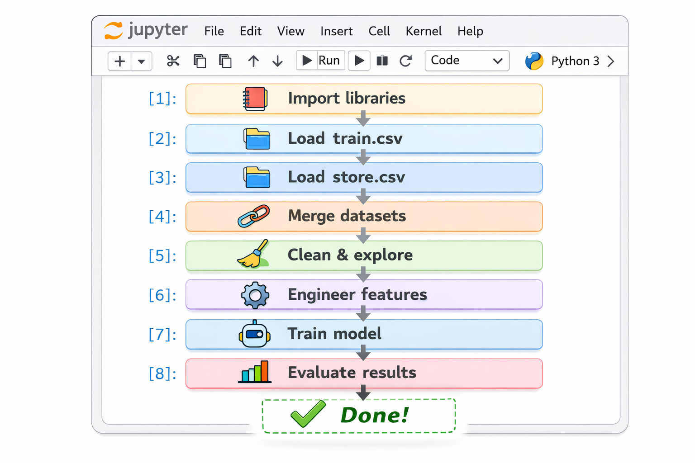
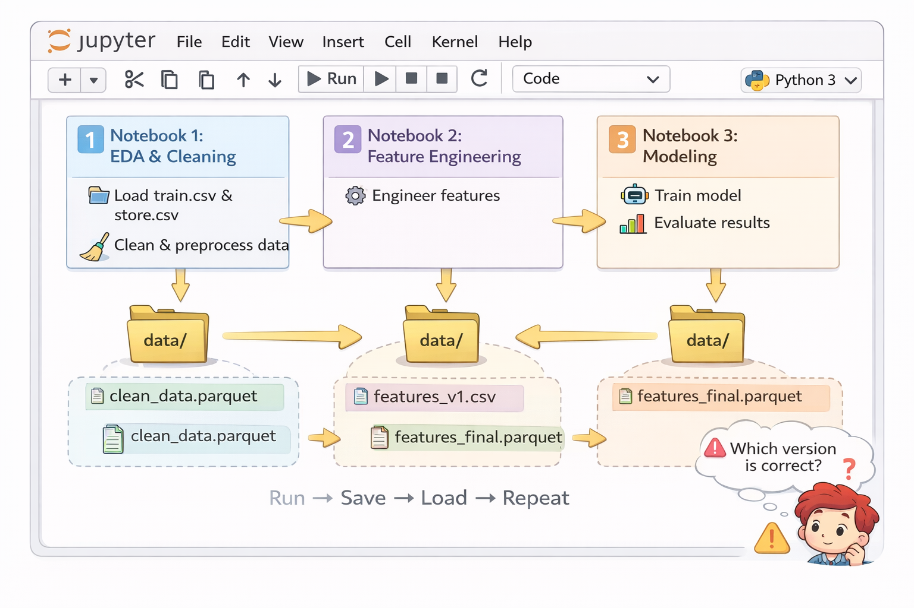
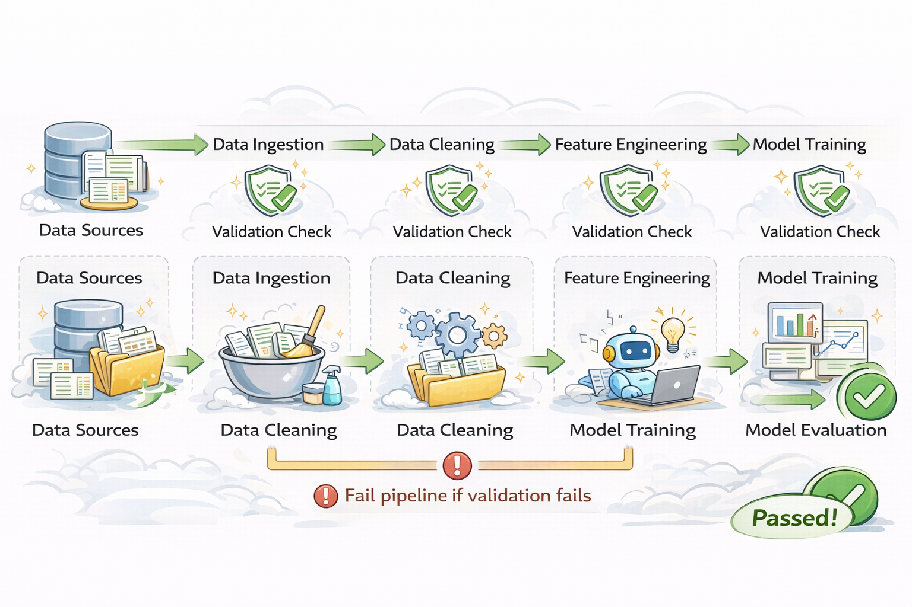
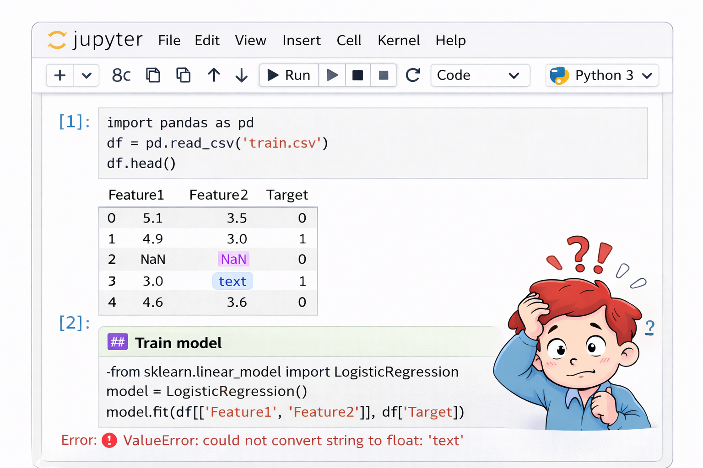
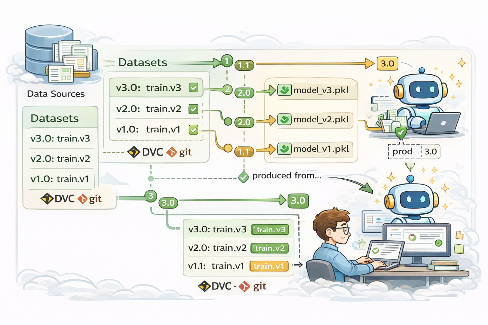
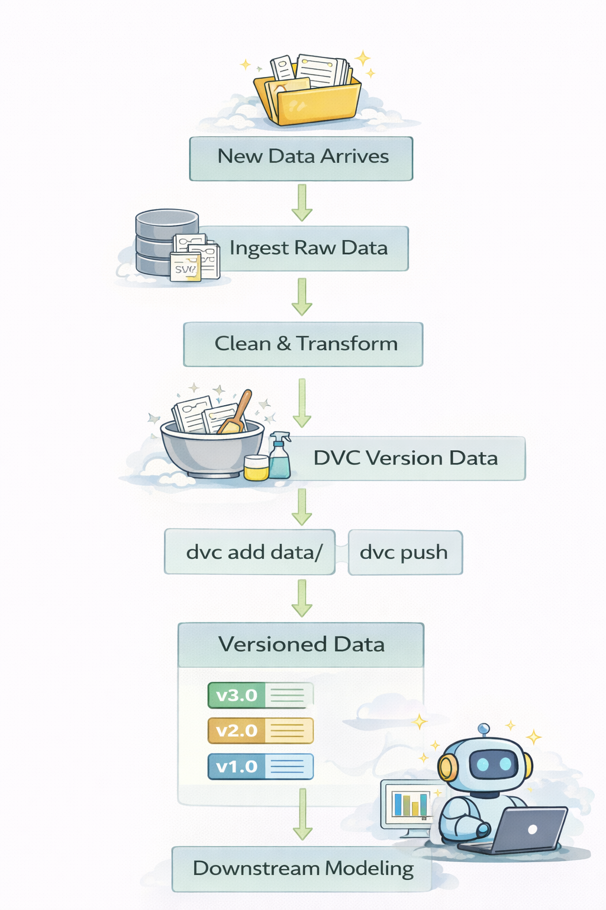
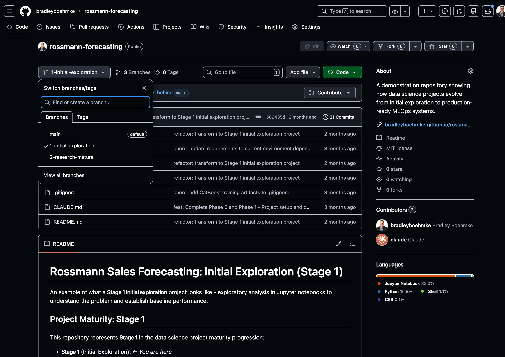

# Welcome {background="#43464B"}

## Applied Workshops Series {background-image="assets/images/bridge.jpg" background-size="cover" background-position="center"}

**Bridging the gap between classroom and industry**

<br><br><br><br><br><br><br><br>
[This series shares best practices and industry standards not always covered in coursework — practical skills that can differentiate you early in your career.]{style="color: white;"}

::: {.notes}
Frame this as part of a larger effort to prepare students for professional environments. The classroom teaches fundamentals, but there are practical skills that matter in industry. This series fills that gap.
:::

## Today's Agenda

* DataOps overview
* Pipeline walk-through
* Direction for hands-on work
* Wrap-up

<br>

::: {.callout-tip}
## Today's Goal
Walk out understanding how to transform exploratory notebooks into reliable, production-ready data pipelines.
:::

::: {.notes}
Set expectations: This is hands-on and practical. We'll see a real example from notebook to production. The goal is to give you a mental model and actionable next steps, not to make you an expert in one session.
:::

# The Problem {background="#43464B"}

## How We Usually Start: Notebooks {.smaller}

::: {.columns}
::: {.column width="50%"}
**Typical workflow:**

* Load data from CSVs
* Merge datasets
* Clean and explore
* Build features
* Train a model
* Get results!
:::
::: {.column width="50%"}
{width=100%}
:::
:::

<br>

::: {.callout-note}
## Academic vs. Industry
In academia, you often complete this entire workflow in a single notebook for assignments. That's perfectly fine for coursework — it gets the job done and helps you learn. But in industry, we need something more robust.
:::

::: {.notes}
This is how most data science projects begin — and should begin! Notebooks are perfect for exploration. Show enthusiasm here, not criticism.
:::

# Let's play this out with an example...

## The Scenario: Rossmann Store Sales {.smaller}

**Business Problem:**

Forecast daily sales for **3,000+ retail stores** across a full region for the next **6 weeks**

<br>

::: {.callout-note}
This is a real-world forecasting problem from the Rossmann Kaggle competition: <https://www.kaggle.com/c/rossmann-store-sales>
:::

. . .

<br>

**Production challenges:**

::: {.columns}
::: {.column width="50%"}
* New sales data arrives **daily**
* Pipeline must run **automatically** to produce fresh forecasts
* Data schema has changed unexpectedly
:::
::: {.column width="50%"}
* Multiple data scientists need to collaborate
* Results must be **reproducible**
* Bad data has slipped through before
:::
:::

::: {.notes}
Set up the real-world operational context. This isn't just about building a model once — it's about running it reliably in production.

Emphasize: "This is the kind of forecasting problem you might see in retail, e-commerce, or supply chain roles. But notice — the challenge isn't just building a good model. It's running that model reliably, day after day, with changing data."

These operational challenges are exactly what DataOps addresses. You're priming them to understand why the notebook approach isn't sufficient.
:::

## The School Approach: Notebooks {.smaller}

::: {.columns}
::: {.column width="50%"}
**Typical workflow (1-3 notebooks):**

* Import train.csv & store.csv
* Merge datasets together
* Exploratory data analysis
* Engineer features
* Train baseline model
* Evaluate performance
* Generate predictions

:::
::: {.column width="50%"}
{width=100%}

**Manual execution:**
Run → Inspect → Run next → Repeat
:::
:::

::: {.callout-note}
[View the notebooks → https://github.com/bradleyboehmke/rossmann-forecasting/tree/1-initial-exploration](https://github.com/bradleyboehmke/rossmann-forecasting/tree/1-initial-exploration)
:::

::: {.notes}
Walk through what a typical school project looks like. Usually 1-3 notebooks that you run sequentially. If you're organized, you might split into separate notebooks for EDA, feature engineering, and modeling.

Point out: This is how you SHOULD start! Notebooks are great for exploration and learning. The issue isn't that this approach is wrong — it's that it doesn't scale to production needs.

Key limitation: You have to run each notebook manually, inspect results, then run the next one. There's no automation, no validation gates, no error handling.

This is the "before" state we'll evolve throughout the workshop.
:::

## Academic vs. Industry: Different Goals {.smaller}

::: {.columns}
::: {.column width="50%"}
**In school:**

* Goal: Learn to analyze & model data
* Focus: Getting results, understanding concepts
* Timeline: Days or Weeks
* Notebooks are **perfect** for this!

:::
::: {.column width="50%"}
**In industry:**

* Goal: Build reliable, maintainable systems
* Focus: Scalability, reproducibility, collaboration
* Timeline: Months, Quarters, Years!
* Notebooks are the **starting point**

:::
:::

<br>

::: {.callout-tip}
## The Evolution
Notebooks for exploration → Structured pipelines for production

We'll focus on the **data pipeline** piece today.
:::

::: {.notes}
This is a critical framing moment. Emphasize:

**Validation, not criticism:** "The notebook approach isn't wrong — it's just optimized for different goals. School optimizes for learning. Industry optimizes for reliability."

**Natural progression:** "In industry, we often START with notebooks to explore possibilities. Then, as the project matures and we need to run it repeatedly, we need more structure."

**Focus for today:** "We could talk about structuring the modeling piece, the deployment piece, the monitoring piece... but today we're focusing on the DATA PIPELINE — how to go from raw data to clean, validated, versioned features. This is the foundation everything else builds on."

This validates their experience, shows them the bigger picture, and sets clear expectations for the workshop scope.
:::

## But Before We Start... {.smaller}

::: {.callout-warning}
## Turn to your neighbor (2-3 minutes):

Discuss what could go wrong when running this notebook workflow in production.
:::

<br>

**Think about scenarios like:**

::: {.columns}
::: {.column width="50%"}
* Data changes over time
* Team collaboration
* Results need to be reproduced
:::
::: {.column width="50%"}
* Bad data appears
* Running daily for months
* Debugging errors
:::
:::

::: {.notes}
**Facilitation (5 minutes total):**

1. Give students 2-3 minutes to discuss with neighbors
2. Call on 2-3 groups to share what they discussed
3. Listen for themes related to:
   - Data quality/validation → leads to validation gates
   - Reproducibility → leads to version control & automation
   - Collaboration → leads to modular code structure
   - Manual processes → leads to automation
   - Debugging complexity → leads to testing & validation

Acknowledge all answers positively. Don't correct — just capture themes on board/slide. Say something like: "Great observations! These are exactly the challenges DataOps addresses. Let's see how."

This primes them for the DataOps principles without lecturing. They're discovering the problem space themselves.
:::

# The Solution: DataOps {background="#43464B"}

## What Is DataOps?

::: {.callout-note}
## DataOps

A set of practices for building **reliable, automated, and maintainable** data pipelines
:::

<br>

**Core Principles:**

* **Modularity** — Reusable, testable code components
* **Quality Assurance** — Validate data at every stage
* **Version Control** — Track code AND data changes
* **Automation** — Run pipelines without manual intervention
* **Reproducibility** — Same inputs → same outputs, always

::: {.notes}
Define DataOps clearly and concretely. Instead of referencing DevOps (which most students won't know), focus on the practical outcome: reliable, automated, maintainable pipelines.

Connect back to their discussion: "Remember the challenges you just discussed — data changing, needing to reproduce results, running daily for months? DataOps is the discipline that addresses exactly those challenges."

Emphasize this isn't about replacing notebooks — it's about evolving from exploration to production. These principles ensure reliability when you need to run something repeatedly in production.
:::

# Principle 1: Modularity {background="#43464B"}

## What Is Modularity? {.smaller}

::: {.callout-important}
## Modularity
Breaking code into reusable, testable components
:::

<br>

**Why it matters:**

* **Collaboration** — Multiple people can work on different modules
* **Testing** — Each component can be tested independently
* **Reusability** — Use the same code across notebooks and production
* **Maintainability** — Fix bugs in one place, not scattered across notebooks

::: {.notes}
Modularity is about organization and reusability. Instead of having all your code in one long notebook,you break it into logical components that can be imported and reused.

Connect to their experience: "You've probably copy-pasted code between notebooks before. Modularity eliminates that — write once, import everywhere."
:::

## Notebook Approach: All in One File {.smaller}

::: {.columns}
::: {.column width="50%"}
**Notebook structure:**
```
notebooks/
└── 01-analysis.ipynb
    ├── Cell 1: load_data()
    ├── Cell 2: clean_data()
    ├── Cell 3: merge_data()
    ├── Cell 4: build_features()
    ├── Cell 5: train_model()
    └── Cell 6: evaluate()
```

All functions defined inline
:::
::: {.column width="50%"}
**Problems:**

* Can't reuse functions across notebooks
* Hard to test individual pieces
* Copy-paste code between projects
* Changes require updating multiple places
:::
:::

::: {.notes}
Point out: You've probably defined the same data cleaning function in 3 different notebooks. When you find a bug, you have to fix it in all 3 places. This is the modularity problem.
:::

## Production Approach: Modular Structure {.smaller}

::: {.columns}
::: {.column width="50%"}
**Project structure:**
```
project/
├── notebooks/
│   └── exploration.ipynb
└── src/
    ├── data/
    │   ├── load.py
    │   ├── clean.py
    │   └── validate.py
    ├── features/
    │   └── build.py
    └── models/
        └── train.py
```
:::
::: {.column width="50%"}
**Benefits:**

* Import functions into any notebook
* Test each module independently
* Fix bugs in one place
* Team members work on different modules
:::
:::

::: {.callout-tip}
Notebooks for **exploration**, `src/` for **production code**
:::

. . .

<br>

[***Let's see this in action with the Rossmann project...***]{style="color: blue;"}

::: {.notes}
Show the rossmann-forecasting repository structure. Point out src/data/make_dataset.py and src/features/build_features.py. These are importable modules that can be used by notebooks, scripts, or APIs.
:::

# Principle 2: Quality Assurance {background="#43464B"}

## What Is Quality Assurance? {.smaller}

::: {.callout-important}
## Quality Assurance
Validating data at every stage to catch errors early
:::

<br>

::: {.columns}
::: {.column}
**Why it matters:**

* **Prevent bad data** from propagating downstream
* **Save debugging time** — catch issues at the source
* **Build confidence** — know your data meets expectations
* **Fail fast** — stop the pipeline when assumptions break
:::
::: {.column}

:::
:::

::: {.notes}
Quality Assurance is about defensive data engineering. Don't assume data is good — verify it.

Share a story: "I once spent 2 days debugging a model, only to find the raw CSV had an extra comma that corrupted half the rows. A 2-minute validation would have caught it immediately."
:::

## Notebook Approach: Hope for the Best {.smaller}

::: {.columns}
::: {.column width="50%"}
**Typical workflow:**

* Load data
* Maybe print `.head()` or `.info()`
* Assume everything is fine
* Proceed with analysis

:::
::: {.column width="50%"}
{width=100%}
:::
:::

<br>

::: {.callout-warning}
## The Problem
If anything changes with data quality, you don't find out until you run a cell and get an error
:::

::: {.notes}
We've all done this — load data, glance at it, assume it's fine. Then weeks later you realize the data had issues all along. By then, you've built everything on top of bad data.
:::


## Production Approach: How? {.smaller}

::: {.callout-tip}
## Great Expectations

A Python library that helps validate your data has the quality and characteristics you expect for downstream analysis.
:::

::: {.columns}
::: {.column width="50%"}
**How it works:**

* Define expectations (schema, types, ranges, distributions)
* Run validation checks at each pipeline stage
* Stop pipeline if data fails validation (`--fail-on-error`)
* Catch issues before they propagate downstream
:::
::: {.column width="50%"}
**Rossmann: 3 validation stages**

1. **Validate Raw Data**
   ```bash
   python src/data/validate_data.py \
     --stage raw --fail-on-error
   ```

2. **Validate Processed Data**
   ```bash
   python src/data/validate_data.py \
     --stage processed --fail-on-error
   ```

3. **Validate Features**
   ```bash
   python src/data/validate_data.py \
     --stage features --fail-on-error
   ```
:::
:::

. . .

[***Let's see this in action with the Rossmann project...***]{style="color: blue;"}

::: {.notes}
Walk through each validation stage. Emphasize `--fail-on-error` — if data is bad, the pipeline stops. Better to fail fast than build on corrupted data.

Tool used: Great Expectations. It's a Python library for data validation.

Now open the rossmann-forecasting repository and demonstrate:
- Show `src/data/validate_data.py` script
- Point out the three validation stages (raw, processed, features)
- Show examples of Great Expectations suites in the expectations/ directory
- Run a validation command to show it in action
:::

# Principle 3: Version Control {background="#43464B"}

## What Is Version Control? {.smaller}

::: {.callout-important}
## Version Control
In industry, we track changes to **code**, **models** AND [**data**]{style="color: blue;"} over time
:::

<br>

::: {.columns}
::: {.column}
**Why it matters:**

* **Rollback** — Undo changes that break things
* **Collaboration** — Multiple people work simultaneously
* **History** — Understand what changed and why
* **Experimentation** — Try ideas without fear
:::
::: {.column}

:::
:::

::: {.notes}
Most students know Git for code. But what about data? Data changes too! Version control for data is critical for reproducibility.
:::

## Notebook Approach: Maybe Git 🤨

**Typical situation:**

* Git tracks notebook files (maybe)
* Git for data is not efficient
* No record of data changes
* Can't recreate results from last month

<br>

::: {.callout-warning}
"Our model performance dropped. Was it code changes or data changes?"

*You'll never know.*
:::

::: {.notes}
Git was designed for text files, not large data files. If you try to commit a 5GB CSV to Git, you'll have problems. So data often goes unversioned. This breaks reproducibility.
:::

## Production Approach: DVC {.smaller}

::: {.columns}
::: {.column}
**Benefits:**

* Track which data version produced which results
* Roll back data to previous state
* Share data across team without Git issues
* Think: **Git for code, DVC for data**

<br>

:::
::: {.column}
**Rossmann approach:**

::: {style="text-align: center;"}
{height=325}
:::

::: {.callout-note}
After you process data, run:
```bash
dvc add data/processed/processed_data.csv
dvc push
```
:::

:::
:::

. . .

[***Let's see this in action with the Rossmann project...***]{style="color: blue;"}

::: {.notes}
DVC (Data Version Control) works like Git for data. It tracks metadata in Git (small), stores actual data remotely (S3, cloud storage). You can check out any historical version.

Example: "Model performance dropped? Check out the code and data from last week, reproduce the results, then bisect to find what changed."

Now open the rossmann-forecasting repository and demonstrate:
- Show `.dvc/` directory and `data.dvc` files
- Point out how DVC tracks data versions in Git (just metadata)
- Show `dvc push` and `dvc pull` commands
- Explain how this enables time travel for both code and data
:::

# Principle 4: Automation {background="#43464B"}

## What Is Automation? {.smaller}

::: {.callout-important}
## Automation
Running pipelines without manual intervention
:::

<br>

**Why it matters:**

* **Consistency** — No human error
* **Speed** — Runs whenever needed
* **Scale** — Process daily updates automatically
* **Freedom** — Focus on analysis, not button-clicking

::: {.notes}
Automation removes manual steps from your pipeline. Once you have modular, validated, versioned code, you can script it to run automatically.

This sets the stage for reproducibility — we'll see how in the next principle.
:::

## Notebook Approach: Manual Execution {.smaller}

::: {.columns}
::: {.column}
**Daily ritual:**

1. Open Notebook 1
2. Click "Run All"
3. Wait... check for errors
4. Open Notebook 2
5. Click "Run All"
6. Repeat for each notebook
7. Hope nothing broke

:::
::: {.column}
::: {style="text-align: center;"}

{height=500}
:::
:::
:::

::: {.callout-warning}
This doesn't scale. What if you need to run this 100x/day?
:::

::: {.notes}
Manual execution is fine for exploration. But imagine running this every day for production forecasts. Or every hour. Or whenever new data arrives. Manual doesn't scale.
:::

## Production Approach: One Command {.smaller}

**Rossmann approach:**

```bash
bash scripts/dataops_workflow.sh
```

**This single command:**

1. ✓ Validates raw data
2. ✓ Processes data
3. ✓ Validates processed data
4. ✓ Builds features
5. ✓ Validates features
6. ✓ Versions data with DVC

**Or schedule it:**
```bash
# Run daily at 6am
0 6 * * * cd /path/to/project && bash scripts/dataops_workflow.sh
```

. . .

<br>

[***Let's see this in action with the Rossmann project...***]{style="color: blue;"}

::: {.notes}
Show the automation script. One command, entire pipeline executes. No manual steps. No forgetting a validation.

This can be scheduled with cron, triggered by new data arrivals, or run in GitHub Actions. Full automation.

Now open the rossmann-forecasting repository and demonstrate:
- Run `bash scripts/dataops_workflow.sh` and show the pipeline executing
- Point out how it orchestrates all the previous principles (modular code, validation gates, versioned data)
- Show how it can be scheduled with cron or GitHub Actions
- Emphasize: automation removes human error and ensures consistency

Set up the transition: "Now, when we combine ALL these principles together — modularity, quality assurance, version control, and automation — we get something powerful: reproducibility. Let's talk about that next."
:::

# Principle 5: Reproducibility {background="#43464B"}

## What Is Reproducibility? {.smaller}

::: {.callout-important}
## Reproducibility
Same inputs → Same outputs, every single time
:::

<br>

**Why it matters:**

* **Trust** — Results can be independently verified
* **Debugging** — Reproduce errors to fix them
* **Collaboration** — Team can recreate your work
* **Compliance** — Auditors can verify processes

::: {.notes}
Reproducibility is the ultimate goal — when you run the same pipeline with the same data, you get identical results every time.

This is what we've been building toward with the previous four principles. Each one contributes to reproducibility.
:::

## Notebook Approach: Manual & Fragile {.smaller}

::: {.columns}
::: {.column}
**Common issues:**

* Inconsistent dependency management
* "Works on my machine"
* Run cells out of order
* Forget to rerun after changes
* Hidden state in memory
* Lack of versioning
:::
::: {.column}
::: {style="text-align: center;"}
{height=500}
:::
:::
:::


::: {.callout-warning}
Even you can't reproduce your own results 6 months later
:::

::: {.notes}
Notebooks have hidden state. You can delete a cell, but the variables are still in memory. Or run cells out of order. The notebook shows output from a previous run, but can't actually be re-executed to produce that output.
:::

## Production Approach: All Principles Working Together {.smaller}

<br>

::: {.columns}
::: {.column width="50%"}
**When you combine:**

* **Modular code** (src/ structure)
* **Validated data** (Great Expectations)
* **Versioned artifacts** (Git + DVC)
* **Automated execution** (workflow scripts)
:::
::: {.column width="50%"}
**You get reproducibility:**

```bash
# Same inputs → Same outputs
bash scripts/dataops_workflow.sh
```

* Fixed execution order
* No hidden state
* Documented dependencies
* Validated at every stage
:::
:::

::: {.callout-tip}
## The Result
Reproducibility isn't a separate thing to implement — it's what you get when you follow the other principles
:::

. . .

<br>

[***Let's see this in action with the Rossmann project...***]{style="color: blue;"}

::: {.notes}
This is the payoff moment. Reproducibility isn't one more thing you have to do — it's the natural outcome of structuring your pipeline correctly.

Show `scripts/dataops_workflow.sh` one more time, but now emphasize how ALL the principles work together:
- Modular code in src/ (Principle 1)
- Validation at each stage (Principle 2)
- Git + DVC tracking everything (Principle 3)
- One script runs it all (Principle 4)
- Result: Perfect reproducibility (Principle 5)

Point out: "This script will produce identical results whether you run it today, next month, or next year — as long as you use the same data version. That's reproducibility."
:::

# Putting It All Together {background="#43464B"}

# From Notebook to Production {background="#43464B"}

## The Transformation Journey

::: {.callout-important}
## Don't Start With Complexity
Projects evolve and mature **progressively** over time. You don't build all this on day one!
:::

<br>

- **Stage 1: Early Exploration** (Notebook-based)
→ Quick insights, manual process, experimentation

- **Stage 2: Research Matures** (DataOps)
→ Add modularity, reusable components, automated data pulls, validation

- **Stage 3: Production Ready** (Full MLOps)
→ In-market testing, model registry, API, monitoring, CI/CD

::: {.notes}
CRITICAL MESSAGE: Emphasize this is progressive, not all-or-nothing.

"Don't try to build Stage 3 on day one! Projects naturally evolve:

**Stage 1:** You start with simple notebooks for exploration. This is normal and good - you're learning the problem space.

**Stage 2:** As your research matures and you run things repeatedly, you start adding the DataOps principles we covered today - modularity, validation, version control, automation. This is what we focused on today.

**Stage 3:** As you approach in-market testing or production deployment, you add more mature components like APIs, monitoring, and CI/CD.

Each stage builds on the previous. The key is recognizing when it's time to evolve to the next stage. If you're running the same notebook weekly, it's time for Stage 2."

Walk through the three-branch structure in the Rossmann repo showing this evolution.
:::

## See It In Action {.smaller}

Explore the three branches in the Rossmann repository to see how the project evolves from notebook-based exploration to a full DataOps pipeline:

::: {.columns}
::: {.column}

* [Stage 1: Initial Exploration](https://github.com/bradleyboehmke/rossmann-forecasting/tree/1-initial-exploration)
* [Stage 2: Maturing Research](https://github.com/bradleyboehmke/rossmann-forecasting/tree/2-research-mature)
* [Stage 3: Production Ready (main)](https://github.com/bradleyboehmke/rossmann-forecasting)
:::
::: {.column}

:::
:::

<br>

::: {.callout-note}
<https://github.com/bradleyboehmke/rossmann-forecasting>
:::

::: {.notes}
Encourage students to explore all three branches. Seeing the progression helps understand why each stage matters. They can fork and experiment.
:::

# Wrap-Up {background="#43464B"}

## Notebooks Are Fine... But Challenge Yourself {.smaller}

**In school and early in your career:**

* Working in simple notebooks is perfectly acceptable
* We do this at work too — for exploration and experimentation
* It's how you learn and iterate quickly

<br>

**As you prepare for industry:**

* Challenge yourself to build production-grade workflows
* Practice the DataOps principles we covered today
* Differentiate yourself by showing you can build reliable systems

::: {.callout-tip}
## The Key Question
"Can I run this reliably, repeatedly, and reproducibly?"
:::

::: {.notes}
Validate their current approach while encouraging growth.

"Everything you've done in notebooks up to this point is valuable. Keep using notebooks for exploration! But as you prepare for industry roles, start practicing production-grade thinking. The employers who hire data scientists want people who can build reliable systems, not just run notebooks once."

This isn't about making them feel bad about notebooks — it's about showing them the next level.
:::

## Study the Rossmann Repository {.smaller}

**Take time to explore how a simple Kaggle dataset can mature into a production-grade system:**

<br>

::: {.columns}
::: {.column}
**What to look for:**

* How notebooks evolve into modules
* Where validation gates are added
* How data versioning works
* How automation ties it together
:::
::: {.column}
**Three branches to explore:**

* [1-initial-exploration](https://github.com/bradleyboehmke/rossmann-forecasting/tree/1-initial-exploration)
* [2-research-mature](https://github.com/bradleyboehmke/rossmann-forecasting/tree/2-research-mature)
* [main (production)](https://github.com/bradleyboehmke/rossmann-forecasting)
:::
:::

::: {.callout-note}
<https://github.com/bradleyboehmke/rossmann-forecasting>
:::

::: {.notes}
Encourage students to spend real time with this repo. Clone it, run the scripts, read the code.

"This is your roadmap. You can take any Kaggle dataset and apply these same principles. The Rossmann example shows you exactly how to structure it, what tools to use, and how to evolve from exploration to production."

This is their reference implementation. They should bookmark it and refer back to it as they build their own projects.
:::

## Now Start Practicing {.smaller}

**Find simple data pipeline projects to practice these principles:**

* Pull data from APIs (weather, finance, sports)
* Build pipelines around Kaggle datasets
* Create ETL workflows for real-world data

<br>

::: {.columns}
::: {.column}
**Basic Notebook Example:**

[Yahoo Finance Notebook](https://github.com/rmacaraeg/yahoo_finance)

* Single notebook approach
* Manual execution
* No validation or versioning
* Good for learning, not for portfolios
:::
::: {.column}
**Production-Grade Example:**

[Jeff Whitcomb's Yahoo Finance Pipeline](https://github.com/whitcojr/Yahoo-Finance-Data-Pipeline)

* Modular `src/` structure
* Test suites for validation
* End-to-end automation

::: {.callout-tip}
**This is what employers want to see**
:::
:::
:::

::: {.notes}
Contrast these two approaches directly.

"As an employer, when I review portfolios, I want to see the project on the left — structured, validated, production-ready. The one on the right shows you can use pandas and make plots, but it doesn't show you can build reliable systems."

"You don't need a massive project. Jeff's pipeline is simple — daily stock data ingestion with validation. But it's structured professionally, and that's what stands out."

Action item: "Pick one small dataset you're interested in. Spend a few weeks building a production-grade pipeline around it. Add it to your portfolio. This will differentiate you in interviews."
:::

## Thank You! {background="#43464B"}

**Questions?**

<br><br>

**Resources:**

* [Rossmann Forecasting Project](https://github.com/bradleyboehmke/rossmann-forecasting)
* [Jeff Whitcomb's Yahoo Finance Pipeline](https://github.com/whitcojr/Yahoo-Finance-Data-Pipeline)
* [DVC Documentation](https://dvc.org)
* [Great Expectations](https://greatexpectations.io)

::: {.notes}
Open for questions. Encourage students to reach out after the workshop.

Final encouragement: "This is a journey. You don't need to master everything today. Start small — pick one principle and apply it to your next project. Build incrementally. You've taken the first step by being here today."

Remind them: the Rossmann repo and these resources will always be available. They can revisit this material as they grow.
:::
